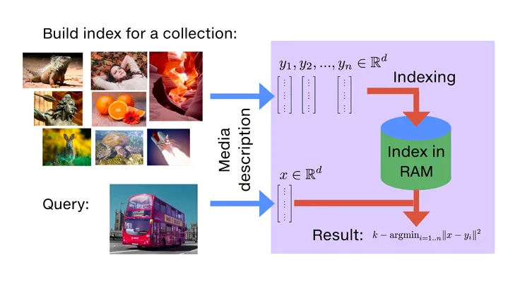
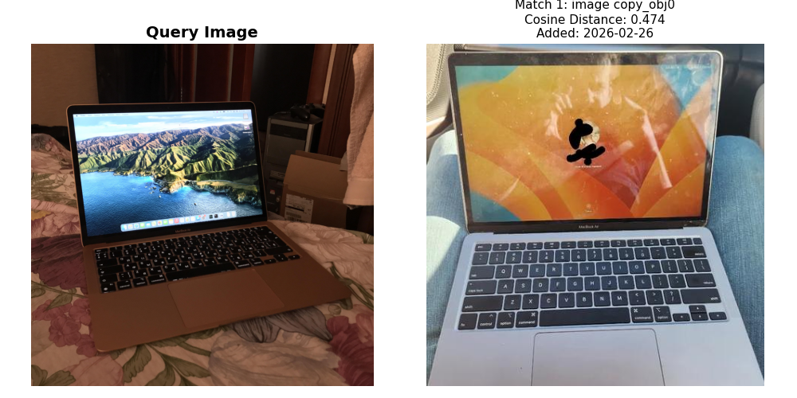
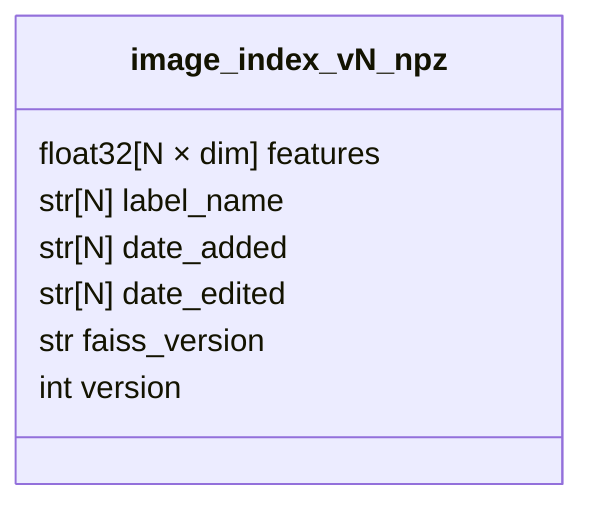

<div align="center">

# Image Retrieval System

**Find lost items by visual similarity — snap a photo, get matches instantly.**



Built with **PyTorch** / **torchvision** · Powered by **ViT** + **Faster R-CNN** + **FAISS**

[](https://www.python.org/)
[](LICENSE)
[](https://docs.astral.sh/uv/)

</div>

---

**What it does** — Drop images of everyday items (shoes, wallets, phones, cards, bags) into a database folder, build an index, then search with a new photo. The system detects individual objects in every image, embeds them with a Vision Transformer, and finds the closest matches using cosine distance.

**Why it exists** — Lost-and-found desks deal with hundreds of items. This turns "does anyone recognize this?" into a quantified visual search.

### Key features

- **Zero CLI arguments** — everything lives in one `config.yaml`
- **Automatic object detection** — Faster R-CNN segments every image into individual object crops before embedding
- **Versioned indexes** — `image_index_v1.npz`, `v2`, `v3`... never overwrite, always reproducible
- **Configurable ViT backbone** — swap between 5 model sizes (768-d to 1280-d) with one line
- **Visual results** — matplotlib popup showing query vs matched crops with cosine distance and date



---

## Architecture

> Full interactive version: open `architecture.excalidraw.json` in [Excalidraw](https://excalidraw.com/)

```mermaid
flowchart LR
    subgraph CONFIG["config.yaml"]
        direction TB
        C1["mode · model · threshold"]
        C2["top_k · index_dir"]
        C3["database_dir · query_image"]
        C4["extensions · version"]
    end

    subgraph INDEX["INDEX Pipeline"]
        direction LR
        I1["Image Database\n.jpg .png .webp"]
        I2["Object Detection\nFaster R-CNN\nMobileNetV3-FPN"]
        I3["Feature Extraction\nVision Transformer"]
        I4["Build Index\nFAISS IndexFlatIP"]
        I5["Save\nimage_index_vN.npz"]
        I1 -- "images" --> I2
        I2 -- "crops" --> I3
        I3 -- "1024-d vectors" --> I4
        I4 -- "L2-normalized" --> I5
    end

    subgraph SEARCH["SEARCH Pipeline"]
        direction LR
        S1["Query Image"]
        S2["Segment Query\nFaster R-CNN"]
        S3["Embed Crops\nViT"]
        S4["FAISS Search\ncosine distance"]
        S5["Results Popup\nmatplotlib"]
        S1 -- "image" --> S2
        S2 -- "crops" --> S3
        S3 -- "vectors" --> S4
        S4 -- "≤ threshold" --> S5
    end

    CONFIG -. "drives" .-> INDEX
    CONFIG -. "drives" .-> SEARCH
    I5 -. "load index" .-> S4

    style CONFIG fill:#fff9db,stroke:#fab005,color:#000
    style INDEX fill:#ebfbee,stroke:#40c057,color:#000
    style SEARCH fill:#d0ebff,stroke:#228be6,color:#000
```



### .npz index contents



---

## How it works

1. **Index** — source images are segmented into object crops (Faster R-CNN), embedded with a Vision Transformer, L2-normalized, and stored in a versioned FAISS index (`.npz`).
2. **Search** — a query image goes through the same segment-then-embed pipeline; FAISS finds the closest embeddings by cosine distance and displays passing matches in a matplotlib popup.

Both pipelines are driven entirely by `config.yaml` — no CLI arguments, no argparse.

---

## Setup

```bash
git clone https://github.com/yourusername/image_ret.git
cd image_ret
./setup.sh
```

The setup script installs `uv` (if missing), runs `uv sync`, and extracts sample images from `data.zip` into `data/database/` and `data/query/`.

<details>
<summary>Manual setup (without script)</summary>

```bash
curl -LsSf https://astral.sh/uv/install.sh | sh   # skip if you have uv
uv sync
unzip data.zip                                      # extract sample images
```

</details>

## Usage

Edit `config.yaml`, then run:

```bash
uv run image-ret
```

### Indexing

Set `mode: index`. Images from `database_dir` are segmented, embedded, and saved to `index_dir` as a versioned `.npz` file.

- If `version` is set (e.g. `version: 1`), the index is saved as `image_index_v1.npz`.
- If `version` is omitted, it auto-increments from the latest existing version.

### Searching

Set `mode: search`. The query image is segmented, embedded, and compared against the loaded index.

- If `version` is set, that specific index is loaded (e.g. `image_index_v2.npz`).
- If `version` is omitted, the latest index in `index_dir` is loaded.
- Only matches with cosine distance **<= threshold** are shown.
- Results pop up in a matplotlib window showing the query alongside matched crops, with cosine distance and date added.

---

## Config reference

```yaml
mode: index               # "index" or "search"

database_dir: data/database
query_image: data/query/photo.jpg

index_dir: data/index     # directory for versioned .npz files
top_k: 3
threshold: 0.5            # cosine distance — lower = more similar; <= threshold pass

version: 1                # specific index version (omit to auto-detect)

supported_extensions:
  - .png
  - .jpg
  - .jpeg
  - .webp

model: vit_l_16
```

### Available models

| Name | Embedding dim | Use case |
|---|---|---|
| `vit_b_32` | 768 | Fastest — prototyping, large datasets |
| `vit_b_16` | 768 | Balanced speed and accuracy |
| `vit_l_32` | 1024 | Higher quality, still reasonable speed |
| `vit_l_16` | 1024 | Best accuracy for most use cases **(recommended)** |
| `vit_h_14` | 1280 | Highest quality, slowest, needs most RAM |

---

## Index format (`.npz`)

Each versioned index file (`image_index_vN.npz`) contains:

| Key | Shape / Type | Description |
|---|---|---|
| `features` | `(N, dim)` float32 | L2-normalized ViT embeddings |
| `label_name` | `(N,)` str | Crop label (e.g. `wallet_1_obj0`) |
| `date_added` | `(N,)` str | ISO timestamp when indexed |
| `date_edited` | `(N,)` str | ISO timestamp of last edit |
| `faiss_version` | scalar str | FAISS library version used to build the index |
| `version` | scalar int | Index version number (v1, v2, ...) |

Use the inspection notebook (`notebooks/inspect_index.ipynb`) to browse index contents as a pandas DataFrame.

---

## Project structure

```
image_ret/
├── config.yaml                      # all configuration lives here
├── pyproject.toml                   # dependencies & entry point
├── setup.sh                         # one-command setup (install + unzip)
├── data.zip                         # sample images archive (database + query)
├── architecture.excalidraw.json     # full interactive architecture diagram
├── src/
│   ├── index_and_retrieve.py        # entry point — reads config, runs index or search
│   ├── feature_extractor.py         # ViT embeddings (configurable model)
│   ├── retrieval_system.py          # FAISS index, .npz save/load, search
│   └── segmenter.py                 # Faster R-CNN MobileNetV3-FPN object detection
├── notebooks/
│   └── inspect_index.ipynb          # browse .npz index contents in pandas
└── data/                            # created by setup.sh / unzip
    ├── database/                    # source images (png, jpg, webp)
    ├── query/                       # query images
    └── index/                       # generated: versioned .npz + crops/
```

## Models used

| Model | Purpose | Details |
|---|---|---|
| **Faster R-CNN MobileNetV3-FPN** | Object detection | Pre-trained on COCO. Crops bounding boxes with confidence > 0.3, filters tiny and full-image boxes. Runs on both index and query images. |
| **Vision Transformer (ViT)** | Feature extraction | Pre-trained on ImageNet. Classifier head removed for raw embeddings. L2-normalized so inner product = cosine similarity. |
| **FAISS IndexFlatIP** | Similarity search | Exact inner-product search on normalized vectors. Cosine distance = 1 − similarity. |

## Tech stack

| Layer | Technology |
|---|---|
| Runtime | Python 3.10+, CPU-only |
| Package manager | [uv](https://docs.astral.sh/uv/) |
| Deep learning | PyTorch, torchvision |
| Search | FAISS (faiss-cpu) |
| Visualization | matplotlib |
| Config | YAML (`pyyaml`) |
| Inspection | Jupyter notebook, pandas |

---

## License

MIT
